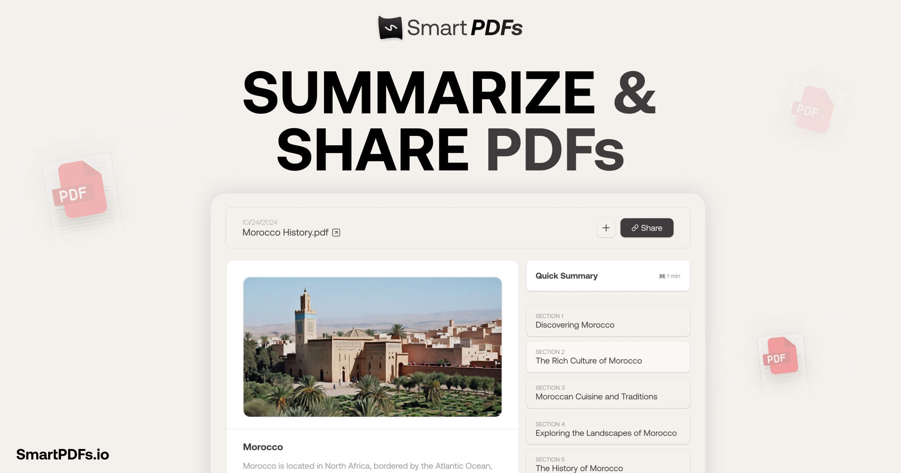

<a href="https://github.com/Nutlope/smartpdfs">
  
  <h1 align="center">SmartPDF</h1>
</a>

  Instantly summarize and section your PDFs with AI. Powered by Llama 3.3 on Together AI.

## Tech stack

- Together AI for LLM inference
- Llama 3.3 for the LLM used
- Next.js 15 with Tailwind CSS
- Prisma ORM with Neon (PostgreSQL)
- S3 for PDF storage

## Cloning & running

1. Clone the repo: `git clone https://github.com/Nutlope/smartpdfs`
2. Create a `.env` file and add your environment variables (see `.example.env`):
   - `TOGETHER_API_KEY=`
   - `DATABASE_URL=`
   - `S3_UPLOAD_KEY=`
   - `S3_UPLOAD_SECRET=`
   - `S3_UPLOAD_BUCKET=`
   - `S3_UPLOAD_REGION=us-east-1`
   - `HELICONE_API_KEY=` (optional, for observability)
3. Run `pnpm install` to install dependencies
4. Run `pnpm prisma generate` to generate the Prisma client
5. Run `pnpm dev` to start the development server

## Roadmap

- [ ] Implement additional revision steps for improved summaries
- [ ] Add demo PDF for new users
- [ ] Implement section combining for better organization
- [ ] Add feedback system with thumbs up/down feature
- [ ] Integrate OCR for image parsing in PDFs
